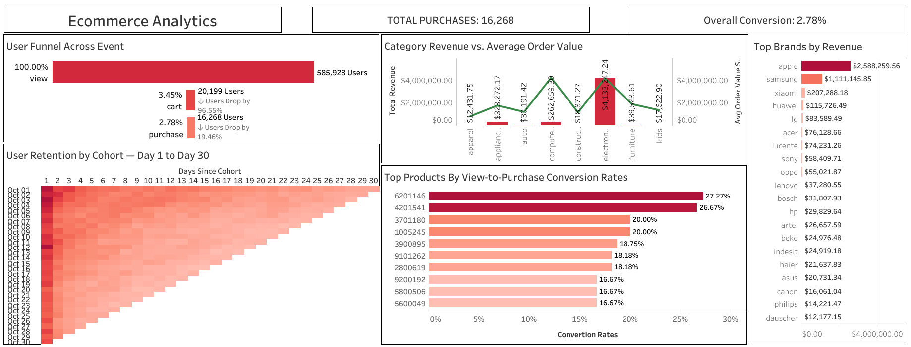

# Ecommerce Analytics SQL + Tableau Dashboard

 
 

## Executive Summary
E-commerce conversion has been low for this online retail platform, and we aimed to determine the root causes and identify opportunities to improve conversion, retention, and revenue.  
Using SQL for data extraction and cleaning, and Tableau for visualization, we analyzed user behavior through the purchase funnel, cohort retention, and product/category performance.  

Key insights:  
- Significant drop-off occurs at the **Add to Cart** stage.  
- Cart → Purchase conversion is strong (~80%), showing users who add items are likely to buy.  
- Certain categories and brands have low conversion despite high traffic.  

Recommendations focus on improving View → Cart conversion, targeted marketing for underperforming categories, and retention strategies for key user cohorts.

---

## Business Problem
Many users browse products but do not add them to the cart or complete purchases, impacting revenue.  
Key questions addressed:  
- Where are users dropping off in the purchase funnel?  
- Which categories, brands, or products have the highest revenue potential?  
- How can retention and repeat purchases be improved?

---

## Methodology
- **Data Sources:** [events_cleaned_final.csv](data/cleaned/events_cleaned_final.csv), [funnel analysis results](results/funnel_analysis/), [cohort analysis results](results/cohort_analysis/), [product & category insights](results/product_and_category_insights/)
- **Data Processing:** Sampled 1M rows, removed duplicates, standardized categories/brands, handled missing values  
- **Tools:** SQL (BigQuery/PostgreSQL), Tableau  
- **Techniques:** Funnel analysis, cohort retention analysis, product & category insights  

---

## Skills
- **SQL:** CTEs, joins, aggregations, window functions
- **Tableau:** Dashboards, KPIs, bar/line charts, heatmaps  
- **Data Analysis:** Metrics derivation, insight extraction, visual storytelling  

---

## Results & Recommendations
**Key Metrics:**  
- Users: 603,499; Viewed products: 585,928  
- Added to cart: 20,199 (~3.45% of viewers); Purchased: 16,268 (~2.78%)  
- Cart → Purchase conversion: ~80.54%  
- Top categories: Electronics 3.65%, Appliances 2.18%  
- Top brands: Samsung, Apple, Xiaomi (2.34–4.18%)  

**Recommendations:**  
- Improve View → Cart conversion via UX improvements, promotions, and reminders  
- Target high-traffic, low-conversion categories with marketing campaigns  
- Monitor cohort retention to engage low-retention users  
- Prioritize high-performing brands for recommendations  

---

## Next Steps
- Implement UX/marketing interventions to increase cart additions  
- AB test promotions, pop-ups, and reminder strategies  
- Track retention improvements and top product performance  
- Maintain dashboards for ongoing visibility  

---
[**Interactive Tableau Dashboard:**](https://public.tableau.com/shared/RFZPBK4Y5?:display_count=n&:origin=viz_share_link)

